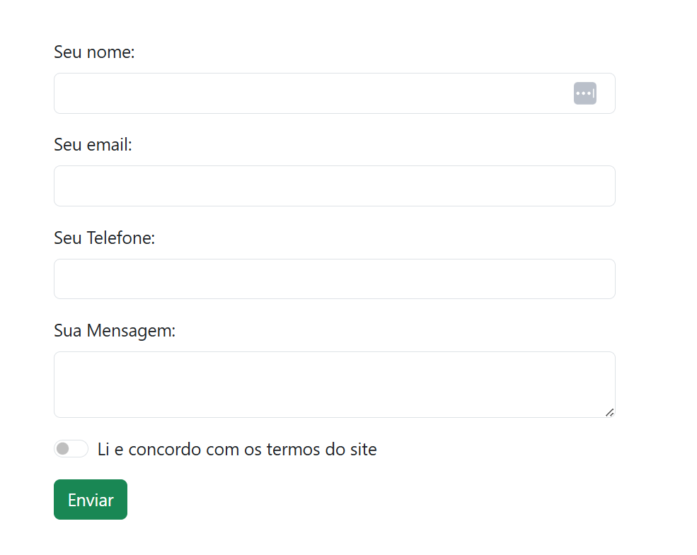

# Meu Projeto de Formulário

Este projeto contém um formulário de cadastro utilizando Bootstrap.

## Formulário

Aqui está uma captura de tela do formulário:

## Como Executar

1. Clone o repositório
2. Abra o arquivo `index.html` no seu navegador

## Tecnologias Utilizadas

- HTML
- Bootstrap 5
